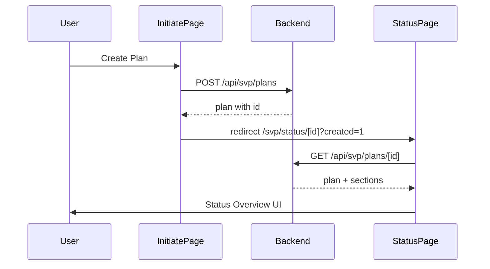

# Site Visit Plan - Status Overview Page

## Goal

After the user clicks **Create Plan** on the Initiate page (`/svp/initiate`), create the plan via the backend and navigate to a new **Site Visit Plan - Status Overview** page that shows the created plan’s summary, section statuses, and actions (Return to List, Cancel Plan, Request Approval), matching the reference image.

## Current State

- **Initiate page**: [frontend/app/svp/initiate/page.js](frontend/app/svp/initiate/page.js) — `handleSubmit` only logs and shows an alert; no API call or redirect.
- **Backend**: No POST for creating a plan; no GET-by-id for a single plan. Plans live in [backend/data/static_data.json](backend/data/static_data.json) under `svp.plans` (id, plan_for, plan_period, plan_name, site_visits, status, team_name, needs_attention).
- **Routing**: Next.js App Router; SVP list at `/svp`, Initiate at `/svp/initiate`. No dynamic SVP route yet.

## Architecture (high level)

## 1. Backend

**File: [backend/data_repository.py**](backend/data_repository.py)

- **get_svp_plan_by_id(plan_id)**  
Load static data, find plan in `svp.plans` where `plan["id"] == plan_id`. If you add an in-memory store for newly created plans (see below), merge that when resolving by id. Return a single plan dict; include a `sections` list (see below). Return `None` if not found.
- **create_svp_plan(payload)**  
Accept dict with: team, planForType, bureau|division|program, periodType, fiscalYear|calendarYear, planName. Build `plan_for` (e.g. "Program - H76"), `plan_period` (e.g. "CY-2026"), `plan_name`, `site_visits`: "0", `status`: "In Progress", `team_name`, `needs_attention`: "". Generate new numeric `id` (max existing + 1). Optionally generate `plan_code` (e.g. "PSV-" + zero-padded id). Append to in-memory list of “created” plans (e.g. a module-level list loaded once from static_data and then appended to; no file write required for MVP). Return the new plan dict including `sections` (see below).

**Plan sections (for both get-by-id and create response):**

- Include a `sections` array on each plan:  
`[{ "id": "cover_sheet", "name": "Cover Sheet", "status": "Not Started" }, { "id": "selected_entities", "name": "Selected Entities", "status": "Not Started" }, { "id": "identified_site_visits", "name": "Identified Site Visits", "status": "Not Started" }]`.  
Newly created plans use these defaults; later you can persist section status per plan.

**File: [backend/app.py**](backend/app.py)

- **POST /api/svp/plans**  
Read JSON body (team, planForType, bureau/division/program, periodType, fiscalYear/calendarYear, planName). Call repository `create_svp_plan`, return `201` with created plan (including `sections`).
- **GET /api/svp/plans/******  
Call `get_svp_plan_by_id(id)`. If missing, return 404. Else return 200 with plan (including `sections`).

## 2. Frontend API

**File: [frontend/app/services/svpService.js**](frontend/app/services/svpService.js)

- **createPlan(payload)**  
`apiPost('/api/svp/plans', payload)` (you will need to add `apiPost` in [frontend/app/services/api.js](frontend/app/services/api.js) if it does not exist).
- **getPlanById(id)**  
`apiGet('/api/svp/plans/' + id)` returning the plan object (with `sections`).

**File: [frontend/app/services/api.js**](frontend/app/services/api.js)

- Add **apiPost(url, body)** that sends `fetch(url, { method: 'POST', headers: { 'Content-Type': 'application/json' }, body: JSON.stringify(body) })` and returns parsed JSON (or throws on non-OK).

## 3. Status Overview page and component

**Route:** `frontend/app/svp/status/[id]/page.js`

- Next.js dynamic segment `[id]`. Page component: load layout (menu, header nav), read `params.id` and optional `searchParams.created`. Fetch plan with `getPlanById(params.id)`. If 404 or error, show error state. Otherwise render a new **SiteVisitPlanStatusOverview** component, passing the plan and a `showSuccessBanner` flag (e.g. true when `searchParams.created === '1'`).

**New component: SiteVisitPlanStatusOverview**

- **Location:** e.g. `frontend/app/components/SiteVisitPlanStatusOverview/SiteVisitPlanStatusOverview.js` (and `SiteVisitPlanStatusOverview.module.css`, `index.js`).
- **Props:** `plan` (object with id, plan_code or id, plan_name, plan_for, plan_period, site_visits, status, sections, etc.), `showSuccessBanner` (boolean).
- **UI to implement (match reference image):**
  1. **Page header:** “Site Visit Plan - Status Overview” with clipboard icon (e.g. `bi-clipboard`).
  2. **Success banner:** If `showSuccessBanner`, a green banner with checkmark: “Success: Plan created successfully.”
  3. **Plan Details (collapsible):** Title row: plan identifier and title (e.g. `plan_code` + “: ” + `plan_name`, or fallback “Plan &lt;id&gt;: ” + `plan_name`). Right side: “Status: &lt;plan.status&gt;”. Body: Plan For, Plan Period, Number of Site Visits. Use local state to toggle open/closed (default open).
  4. **Resources (collapsible):** Section title “Resources” with external-link icon. Content: “Current Documents” as a tab label; below it, three links separated by vertical bars: “View Plan”, “Program Plan”, “View Contributions” (href can be `#` or placeholders for now). Collapsed state toggle (default open).
  5. **Plan Section Status table:** Table with columns Section, Status, Options. One row per `plan.sections`: Section name, status text (e.g. “Not Started” with checkmark icon), Options: “Update” button with pencil icon and dropdown arrow (dropdown can be a stub or no-op for MVP).
  6. **Footer:** Left: “Return to List” button linking to `/svp`. Right: “Cancel Plan” and “Request Approval” buttons (actions can be no-op or stubs for MVP).

Reuse existing layout and styling patterns from [InitiatePlanForm.module.css](frontend/app/components/InitiatePlanForm/InitiatePlanForm.module.css) and [SiteVisitPlanList](frontend/app/components/SiteVisitPlanList/SiteVisitPlanList.js) (e.g. palette, buttons, section borders) so the Status Overview fits the rest of the SVP UI.

## 4. Initiate page: submit and redirect

**File: [frontend/app/svp/initiate/page.js**](frontend/app/svp/initiate/page.js)

- In `handleSubmit`: call `createPlan(formData)` (map form fields to the payload expected by the backend: team, planForType, bureau/division/program, periodType, fiscalYear/calendarYear, planName).
- On success: redirect to `/svp/status/${response.id}?created=1` using Next.js `useRouter().push(...)`.
- On failure: set an error state and display it (e.g. under the form or in a small banner) instead of `alert`.

## 5. Optional: link from List to Status Overview

- In [SiteVisitPlanList.js](frontend/app/components/SiteVisitPlanList/SiteVisitPlanList.js) (or DataGrid row actions), ensure “View Plan” or “Edit Plan” navigates to `/svp/status/<plan.id>` where appropriate, so users can open the same Status Overview from the list. This may already be implied by row actions; if not, add the link to the correct action.

## Data shape summary

- **Create request (frontend to backend):**  
`{ team, planForType, bureau?, division?, program?, periodType, fiscalYear?, calendarYear?, planName }`
- **Plan response (backend to frontend):**  
`{ id, plan_code?, plan_for, plan_period, plan_name, site_visits, status, team_name, needs_attention, sections: [{ id, name, status }] }`

## Files to add

- `frontend/app/svp/status/[id]/page.js`
- `frontend/app/components/SiteVisitPlanStatusOverview/SiteVisitPlanStatusOverview.js`
- `frontend/app/components/SiteVisitPlanStatusOverview/SiteVisitPlanStatusOverview.module.css`
- `frontend/app/components/SiteVisitPlanStatusOverview/index.js`

## Files to modify

- `backend/data_repository.py` — add `get_svp_plan_by_id`, `create_svp_plan`, in-memory plan list if needed
- `backend/app.py` — add POST `/api/svp/plans`, GET `/api/svp/plans/<id>`
- `frontend/app/services/api.js` — add `apiPost`
- `frontend/app/services/svpService.js` — add `createPlan`, `getPlanById`
- `frontend/app/svp/initiate/page.js` — call `createPlan`, redirect on success, show error on failure

No changes to the Initiate form component itself are required beyond the parent page calling the API and redirecting.